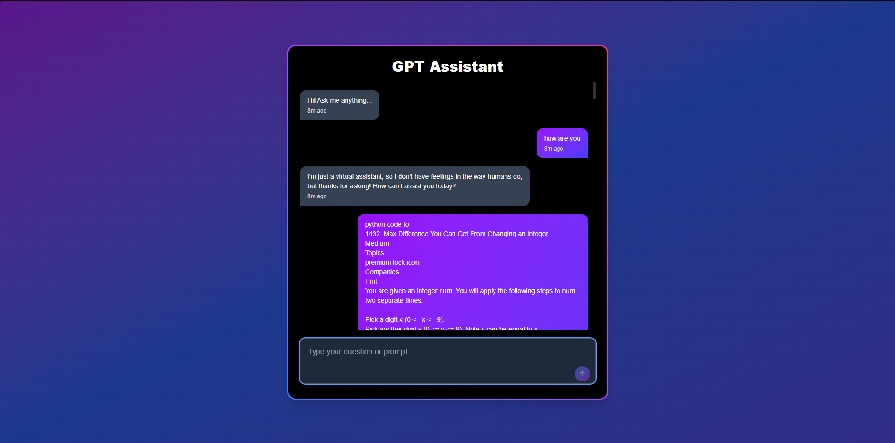

# 🧠 GPT Assistant – A ChatGPT Clone

An elegant and functional frontend clone of ChatGPT, built using **React**, **Vite**, and **Tailwind CSS**. Designed to replicate the feel of modern AI chat apps like Aidy and ChatGPT, with dynamic UI, chat history, and smooth UX.

---

## 🚀 Live Demo

🌐 [Click here to try GPT Assistant](https://gpt-assistant-red.vercel.app)  
*(Replace this with your actual deployment link — Vercel, Netlify, etc.)*

---

## 🛠️ Features

- ✅ Chat UI inspired by ChatGPT
- ✅ Typing animation for assistant responses
- ✅ Scrollable message history with timestamps
- ✅ Dark mode with animated gradient background
- ✅ Responsive design with mobile support
- ✅ Ready for OpenRouter or OpenAI integration

---

## 📸 Screenshot Preview

<p align="center">
  
</p>

---

## ⚙️ Tech Stack

| Tool            | Description                      |
|-----------------|----------------------------------|
| React           | UI library                       |
| Vite            | Fast build tool                  |
| Tailwind CSS    | Utility-first CSS framework      |
| OpenRouter API  | (or OpenAI) for AI responses     |

---

## 📦 Installation & Setup

```bash
# 1. Clone the repository
git clone https://github.com/ShaunakMishra25/GPT-Assistant.git
cd GPT-Assistant

# 2. Install dependencies
npm install

# 3. Add your API key to a .env file
echo "VITE_OPENROUTER_API_KEY=sk-xxxxxxxxxxxx" > .env

# 4. Run the development server
npm run dev
